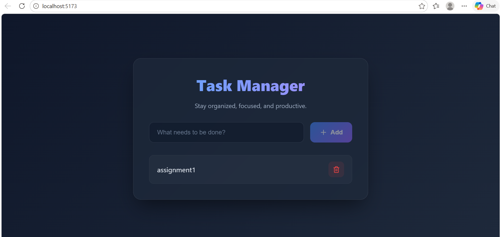

# Full Stack Task Manager

A simple, beautiful, and efficient full stack Todo application built as an assignment for a Full Stack Developer internship position.

## 📸 Screenshots



## 🚀 Features

- **Add Task:** Enter a task and click the "Add" button to seamlessly save it.
- **Delete Task:** Remove completed or unwanted tasks with a single click.
- **Modern UI:** Features a clean, premium dark-mode design with glassmorphism and smooth animations.
- **Real-time Interaction:** Frontend connects with the backend API to ensure data is always up to date.

## 💻 Tech Stack

- **Frontend:** React (Vite), Vanilla CSS, Axios
- **Backend:** Node.js, Express.js
- **Database:** In-memory Array (Extremely fast, zero-configuration setup for immediate testing)

## 🔌 API Endpoints

- **`GET /todos`** → Fetch all tasks
- **`POST /todos`** → Add a new task
- **`DELETE /todos/:id`** → Delete a specific task

## 🛠️ How to Run the Project

Follow these instructions to run the project locally on your machine.

### Prerequisites
- Node.js installed on your machine

### 1. Start the Backend server

Open a terminal window and run:

```bash
cd backend
npm install
node index.js
```

The backend server will start running on `http://localhost:5000`.

### 2. Start the Frontend development server

Open a **new** terminal window and run:

```bash
cd frontend
npm install
npm run dev
```

The application will be accessible at `http://localhost:5173`. Open this URL in your browser to view and interact with the app.

## 💡 Notes
- Make sure both the backend and frontend servers are running concurrently for the application to function perfectly.
- The UI is designed to be highly responsive and intuitive, ensuring an excellent user experience.
